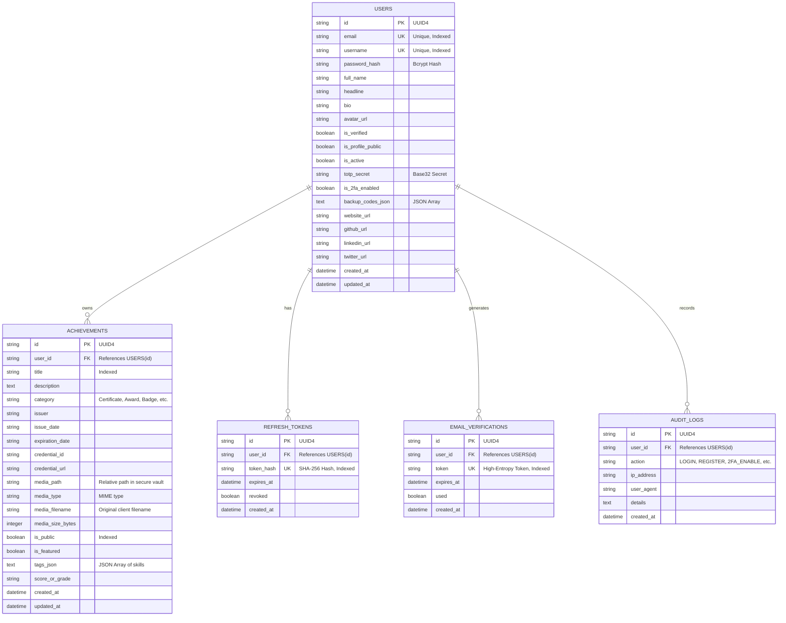

# 🗄️ Credence — Database Schema & Data Models

Credence utilizes SQLAlchemy ORM with support for SQLite (default local zero-configuration) and PostgreSQL. All sensitive credentials, tokens, and audit logs are strongly typed and indexed.

---

## 1. Entity Relationship Diagram

---

## 2. Table Definitions & Field Types

### `users`
| Column | Type | Constraints | Description |
|---|---|---|---|
| `id` | VARCHAR(36) | PRIMARY KEY | Unique UUID identifier |
| `email` | VARCHAR(255) | UNIQUE, NOT NULL, INDEX | User email address |
| `username` | VARCHAR(50) | UNIQUE, NOT NULL, INDEX | Unique handle for `/u/{username}` |
| `password_hash` | VARCHAR(255) | NOT NULL | Bcrypt hashed password (12 rounds) |
| `full_name` | VARCHAR(100) | NOT NULL | User's full display name |
| `headline` | VARCHAR(255) | NULLABLE | Professional summary or title |
| `bio` | TEXT | NULLABLE | Detailed biographical summary |
| `avatar_url` | VARCHAR(500) | NULLABLE | Remote image or uploaded avatar URL |
| `is_verified` | BOOLEAN | DEFAULT FALSE | Email verification status |
| `is_profile_public`| BOOLEAN | DEFAULT TRUE | Master privacy switch for public portfolio |
| `is_active` | BOOLEAN | DEFAULT TRUE | Account state |
| `totp_secret` | VARCHAR(64) | NULLABLE | RFC 6238 Base32 Secret |
| `is_2fa_enabled` | BOOLEAN | DEFAULT FALSE | Two-factor authentication status |
| `backup_codes_json`| TEXT | DEFAULT "[]" | Emergency single-use backup recovery codes |
| `created_at` | DATETIME | DEFAULT UTC NOW | Record creation timestamp |
| `updated_at` | DATETIME | ON UPDATE UTC NOW | Last modified timestamp |

---

### `achievements`
| Column | Type | Constraints | Description |
|---|---|---|---|
| `id` | VARCHAR(36) | PRIMARY KEY | Unique UUID identifier |
| `user_id` | VARCHAR(36) | FOREIGN KEY, INDEX | Owner foreign key (`users.id`) |
| `title` | VARCHAR(255) | NOT NULL, INDEX | Title of credential / award |
| `description` | TEXT | DEFAULT "" | Detailed description and impact |
| `category` | VARCHAR(50) | NOT NULL, INDEX | Certificate, Award, Badge, etc. |
| `issuer` | VARCHAR(150) | NOT NULL | Issuing entity (e.g. AWS, Stanford) |
| `issue_date` | VARCHAR(20) | NOT NULL | Date earned (YYYY-MM-DD or Month YYYY) |
| `expiration_date`| VARCHAR(20) | NULLABLE | Expiration date if applicable |
| `credential_id` | VARCHAR(100) | NULLABLE | Verification license/serial number |
| `credential_url`| VARCHAR(500) | NULLABLE | External verification link |
| `media_path` | VARCHAR(500) | NULLABLE | Scrambled UUID path in uploads vault |
| `media_type` | VARCHAR(50) | NULLABLE | Verified MIME type |
| `media_filename`| VARCHAR(255) | NULLABLE | Original sanitized filename |
| `media_size_bytes`| INTEGER | DEFAULT 0 | Size of uploaded file in bytes |
| `is_public` | BOOLEAN | DEFAULT TRUE, INDEX | Public visibility toggle per item |
| `is_featured` | BOOLEAN | DEFAULT FALSE | Star/pin showcase highlight |
| `tags_json` | TEXT | DEFAULT "[]" | JSON array of skill tags |
| `score_or_grade`| VARCHAR(50) | NULLABLE | Grade / Rank / Placement |
| `created_at` | DATETIME | DEFAULT UTC NOW | Timestamp |
| `updated_at` | DATETIME | ON UPDATE UTC NOW | Timestamp |

---

### `refresh_tokens`
| Column | Type | Constraints | Description |
|---|---|---|---|
| `id` | VARCHAR(36) | PRIMARY KEY | Unique UUID identifier |
| `user_id` | VARCHAR(36) | FOREIGN KEY, INDEX | User foreign key |
| `token_hash` | VARCHAR(255) | UNIQUE, NOT NULL | SHA-256 hash of refresh token |
| `expires_at` | DATETIME | NOT NULL | Token expiry timestamp (7 days) |
| `revoked` | BOOLEAN | DEFAULT FALSE | Instant revocation status |
| `created_at` | DATETIME | DEFAULT UTC NOW | Creation timestamp |

---

### `email_verifications`
| Column | Type | Constraints | Description |
|---|---|---|---|
| `id` | VARCHAR(36) | PRIMARY KEY | Unique UUID identifier |
| `user_id` | VARCHAR(36) | FOREIGN KEY, INDEX | User foreign key |
| `token` | VARCHAR(128) | UNIQUE, NOT NULL | High-entropy crypto verification token |
| `expires_at` | DATETIME | NOT NULL | Expiry timestamp (24 hours) |
| `used` | BOOLEAN | DEFAULT FALSE | Token single-use flag |
| `created_at` | DATETIME | DEFAULT UTC NOW | Creation timestamp |
